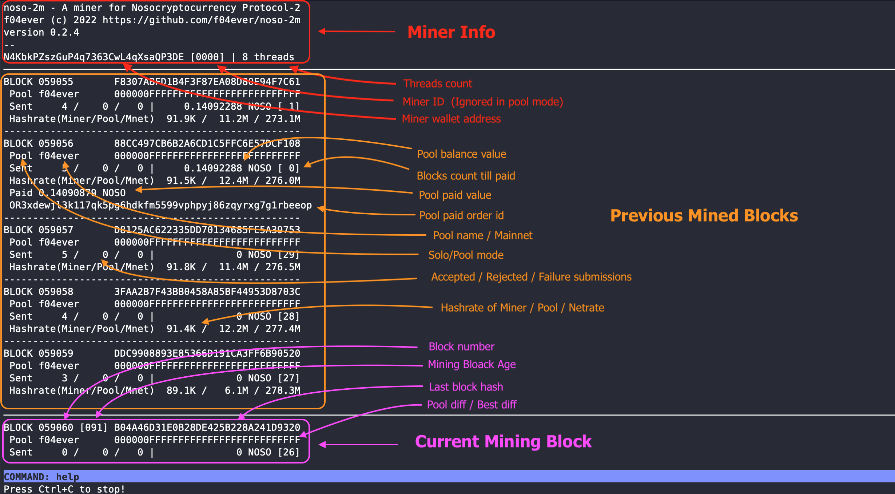

# NOSO-2M

[](https://github.com/f04ever/noso-2m/releases/latest)
[](https://github.com/f04ever/noso-2m/releases/latest)
[](https://github.com/f04ever/noso-2m/releases/latest)
[](https://github.com/f04ever/noso-2m/releases/latest)
[](https://github.com/f04ever/noso-2m/releases)

A miner for Nosocryptocurrency Protocol-2.

`noso-2m` supports mining on both ***solo*** and ***pool*** modes on mainnet. `noso-2m` supports *_failover_* to other pools in pool mining mode.

`noso-2m` is developed using C/C++, compatible with standards C++17/20. It is expected to be buildable and executable on a wide range of hardware architectures (Intel, AMD, arm, aarch64) and operating systems (Linux, macOS, Android (Termux), and Windows).

From version 0.2.4, noso-2m supports a simple text UI that expects to make new users getting started with noso-2m easier. A logging file `noso-2m.log` is provided as well for advanced users. 

A command line provides information during mining:
- Use command `help` to list all the commands and their meaning. 
- The command `pools` shows information of pools listed in config file or provided when run the `noso-2m` program. 
- The command `threads` displays Hashrate information for all threads, only after one block has passed.

> **NOTE**: On Microsoft Windows, don't try to resize the console window since an issue from the `ncurses` library causes text to distort (does not affect the mining jobs).



## Run `noso-2m` miner

`noso-2m` currently provides executable 64-bits and 32-bits versions for Linux, Android(Termux), macOS, and Windows pre-built on architectures amd64/x86\_64, aarch64/arm64, i686, and arm. Just download the appropriate version, uncompress the archive and run it from the command line as bellow:

### On Linux, MacOS, or Android (Termux)

```console
$ ./noso-2m -a WALLETADDRESS -t THREADCOUNT 2>errors.txt
```

### On Windows

```console
> noso-2m.exe -a WALLETADDRESS -t THREADCOUNT 2> errors.txt
```

### Help

- By default, `noso-2m` mines using arguments it loads from a config file named `noso-2m.cfg` at the same location of the `noso-2m` binary, in case it's present.

- Config file contents example:
    ```
    address WALLETADDRESS
    minerid MINERID****
    threads THREADCOUNT
    pools POOL-URL-LIST
    solo false
    ```

- The config file can be located somewhere else and be specified using option `--config="PATH-TO-CONFIG-FILE"`.

- Arguments loading from the config file will override the options provided on the command line.

- By default, `noso-2m` mines in `pool mode`, and does failover between two pools: the `f04ever` pool and the `devnoso` pool.

- You can provide custom pool addresses on the command line by using option `--pools="POOL-URL-LIST"` (opening and closing quotation marks (`"`) are mandatory if having more than one pool URLs provided)

- If more than one pool address is provided, `noso-2m` will do failover between provided pools when the current mining pool becomes unreacheable (pool off, network problem, ...).

- Syntax of `POOL-URL-LIST` is as follows:

    - `POOL-URL-LIST` is a list of `POOL-URL`s, separated by a semicolon (`;`), ex.: `POOL-URL-1;POOL-URL-2;POOL-URL-3`

    - `POOL-URL` syntax: `POOL-NAME:POOL-ADDRESS:POOL-PORT`, the colon (`:`) is used to separate parts.

    - `POOL-NAME` is an arbitrary name, ex.: devnoso, my-pool, pool-1, pool-2, ...

    - `POOL-ADDRESS` is either a valid IP address or a domain name of the pool.

    - `POOL-PORT` is a valid port number for the pool, if omitted `POOL-PORT` will default to port `8082`.

    - `noso-2m` has 2 inbuilt shortcuts for pools: `f04ever` and `devnoso`. When using the short-cuts one can ommit `POOL-IP-ADDRESS` and `POOL-PORT`.

    - An example: 
        ```console
        $ ./noso-2m -a N3G1HhkpXvmLcsWFXySdAxX3GZpkMFS -i 1000 -t 8 --pools="f04ever:209.126.80.203:8082;devnoso:45.146.252.103:8082"
        ```

- Use option `--solo` for solo mining mode on the mainnet. You need to provide a `Miner ID` via the  option `-i` / `--minerid` if you plan on mining with multiple machines using the same wallet address when in solo mode.

- Use `--help` for the more details on this command.

## Build from source

### Downloading the source

Using `HTTPS`:
```console
$ git clone https://github.com/f04ever/noso-2m.git
```

Using `SSH`:
```console
$ git clone git@github.com:f04ever/noso-2m.git
```

### Linux

On Linux/macOS/Android(Termux), it requires clang, or gcc.

On an Ubuntu machine you can install the dependencies with the following command:

```console
$ sudo apt install build-essential clang lld libc++-dev libc++adb-dev
```

### Windows

On Windows, it requires clang and Build Tools for Visual Studio.

### Important

- Currently `noso-2m` is compatiple with C++14/17/20. So, clang version 3.4 or later, or gcc version 6.1 or later. We recommend building `noso-2m` with `c++20`.

- You can replace `c++20` in the build command below with `c++17` in case you have an older version of clang, gcc, or Windows Build Tools.

### Building on Linux, MacOS, or Android (Termux)

```console
$ clang++ noso-2m.cpp md5-c.cpp -o noso-2m -std=c++20 -O3 -DNDEBUG --stdlib=libc++ -fuse-ld=lld -lpthread -lc++abi -lncurses -lform -ltermcap
```

Or use gcc,

```console
$ g++ noso-2m.cpp md5-c.cpp -o noso-2m -std=c++20 -O3 -DNDEBUG -lpthread -lncurses -lform -ltermcap
```

### Building on Windows

```console
> clang++ noso-2m.cpp md5-c.cpp -o noso-2m.exe -std=c++20 -O2 -DNDEBUG -lWs2_32.lib
```

Or use clang compatible driver mode for Microsoft Build Tools

```console
> clang-cl noso-2m.cpp md5-c.cpp /o noso-2m.exe /std:c++20 /O2 /EHsc /DNDEBUG /link Ws2_32.lib
```

## Donations

Nosocoin: `devteam_donations`

** The donations will go to `devteam_donations` - the wallet address of the [nosocoin's development team](https://www.nosocoin.com/) as they deserve it (***it is not my personal address***).
